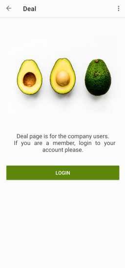

# Loyalty Club Android Application
This is an open-source project connected to Formaloo CDP API for building a loyalty club for any business.
every business can modify it and use it as their official loyalty app.
https://en.formaloo.com/developers/

## Installation
Clone this repository and import into **Android Studio**

git clone https://github.com/formaloo/formaloo-android-my-bussiness-with-loyalty-and-gamification.git

## The App
The sample app displays a list of deals that is available for the users who are the business customers. 

You can install [Loyalty APK](https://git.idearun.co/ideaformz/loyalty-club-android-app/-/tree/master/application%20file/Loyalty.apk) on your phone 

# Archi
* __MVVM__: Model View ViewModel with LiveData.

## Api Token
To access API token you need an account on https://cdp.formaloo.net/. 
After sign in to your account go to connection tab and copy the provided key.

### Libraries used
The application supports Android 4.4 KitKat (API level 19) and above.

* Kotlin
* AppCompat, CardView and RecyclerView
* Navigation component
* Room
* Coroutines
* Koin di
* Retrofit 2
* Glide

